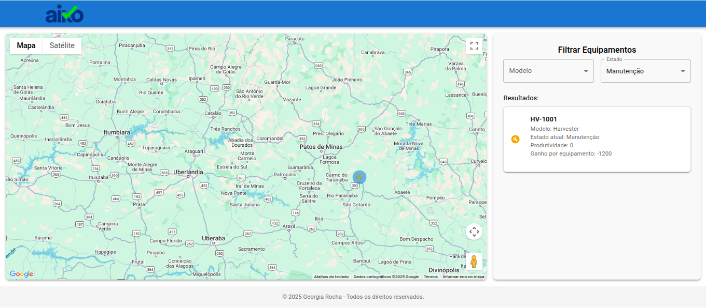
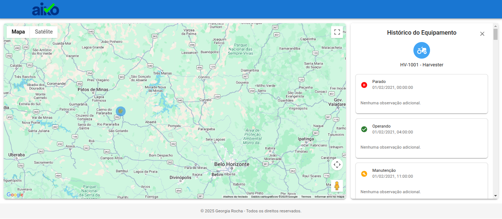

# 🌲 Forest Operations

Aplicação frontend para visualização e análise de dados de equipamentos utilizados em operações florestais. Desenvolvido para auxiliar gestores no monitoramento de produtividade e estado dos ativos da operação.
---
🎥 [Vídeo de demonstração](https://www.loom.com/share/04fdf925b38f4c8884939085319bc2a1) : https://www.loom.com/share/04fdf925b38f4c8884939085319bc2a1

<br/>



<br/>
<br/>



<br/>

---

## 📌 Descrição do Desafio

Visualizar:

- **Histórico de posições** (via GPS)
- **Histórico de estados** (Operando, Parado, Manutenção)

Com esses dados, é possível visualizar a operação em tempo real e realizar análises sobre produtividade, desempenho e ganho financeiro de cada equipamento.

---

## ✅ Funcionalidades Implementadas

### 🗺️ Visualização no Mapa

- Exibe os **equipamentos nas suas posições mais recentes** no mapa.
- Visualização interativa com **pop-up ao passar o mouse**, exibindo o nome e o estado atual do equipamento.
- Diferencia visualmente os equipamentos **por modelo**, com uso de ícones ou cores distintas.

### 🔎 Filtros

- Permite **filtrar os equipamentos** exibidos por:
  - Modelo
  - Estado atual

### 📈 Cálculo de Produtividade

- **Fórmula:** `(horas operando / total de horas) * 100`
- Exibido em percentual por equipamento, com base no histórico de estados.

### 💰 Cálculo de Ganhos

- Calculado com base nas horas e nos valores definidos no **modelo de equipamento**.
- Exemplo:  
  Se um modelo gera `100/h` operando e `-20/h` em manutenção,  
  e o equipamento ficou `10h operando` e `4h em manutenção`,  
  então o ganho = `10*100 + 4*(-20) = 920`.

### 💬 Histórico de Estados

- Ao clicar em um equipamento, é possível visualizar o **histórico completo de estados**, com data/hora de cada mudança.

---

## 🚧 Melhorias Planejadas

- **Histórico de posições**: exibir o trajeto percorrido pelo equipamento.
- **Redux**: para controle global de estados da aplicação.
- **Aprimoramento da interface**: como animações, responsividade e dark mode.
- **Documentação dos componentes**: MDX, por exemplo.
- **Adição de Tela de Login com validação**: JWT.

---

## 🧪 Testes

A aplicação conta com testes utilizando **React Testing Library** e **Jest**:

- ✅ Testes unitários para componentes (`Header`, `Footer`, `EquipmentCard`, etc.)
- ✅ Mock de funções auxiliares (`getStatusIcon`)
- ✅ Verificação da renderização dos elementos na DOM

> Futuramente, testes de integração e acessibilidade também podem ser adicionados.

## ⚙️ Tecnologias Utilizadas

- **React + TypeScript**
- **Vite** (para build e dev server)
- **Material UI** (componentes visuais)
- **Google Maps JS API** (para visualização geográfica)
- **Jest + RTL** (para testes)

---

## 📦 Como rodar o projeto

```bash
# Instale as dependências
npm install

# Inicie o servidor de desenvolvimento
npm run dev

# Execute os testes
npm test